# Architecture

```mermaid
flowchart LR
    SEC[SEC 2025 Q4 ZIP] -->|Identifying User-Agent; retries| CACHE[Cached ZIP + source manifest]
    MANUAL[Manual official ZIP] --> CACHE
    CACHE -->|Extract only 3 TSVs| RAW[(DuckDB raw: SUBMISSION / REGISTRANT / FUND_REPORTED_INFO)]
    RAW --> STAGE[dbt staging: types + nulls]
    STAGE --> FILINGS[Fund filings]
    FILINGS --> DIM[dim_fund]
    FILINGS --> SNAP[fact_fund_snapshots: amendment winners]
    SNAP --> FLOWS[fact_monthly_flows: MON1–3 + overlap winners]
    FLOWS --> SPINE[Daily time spine]
    YAML[dbt semantic YAML: entities + metrics] -->|dbt parse| MANIFEST[Semantic manifest]
    UI[Streamlit filters / cards / trends / rankings] --> WRAPPER[Cached subprocess + CSV wrapper]
    WRAPPER -->|mf query / mf query --explain| MF[MetricFlow CLI]
    MANIFEST --> MF
    MF -->|Generated SQL| DB[(DuckDB marts + time spine)]
    DIM --> DB
    SNAP --> DB
    FLOWS --> DB
    SPINE --> DB
    DB -->|Metric results| MF
    MF -->|CSV results / generated SQL| WRAPPER
    WRAPPER --> UI
```

Ingestion and dbt are batch commands. Streamlit opens a short read-only connection
only for dimension members and available dates. Every number presented as a metric,
including coverage and quality counts, goes through `mf query`. The wrapper never
executes generated SQL itself; `--explain` is an inspection path.

The two facts share a foreign `fund` entity. `dim_fund` declares `fund` primary.
MetricFlow may join each fact to that unique dimension; the foreign-to-foreign
fact join is not a valid semantic join. Multi-fact queries aggregate the facts
separately before combining results at the requested dimensions. Uniqueness and
relationship tests enforce the declarations.

Cache keys include the parsed semantic manifest, database modification time/size,
all CLI arguments and whether the request is an explanation. Editing YAML requires
`make parse`; stale YAML is rejected until reparsed. A refresh changes the database
fingerprint. Cached query files are local and ignored by Git.
